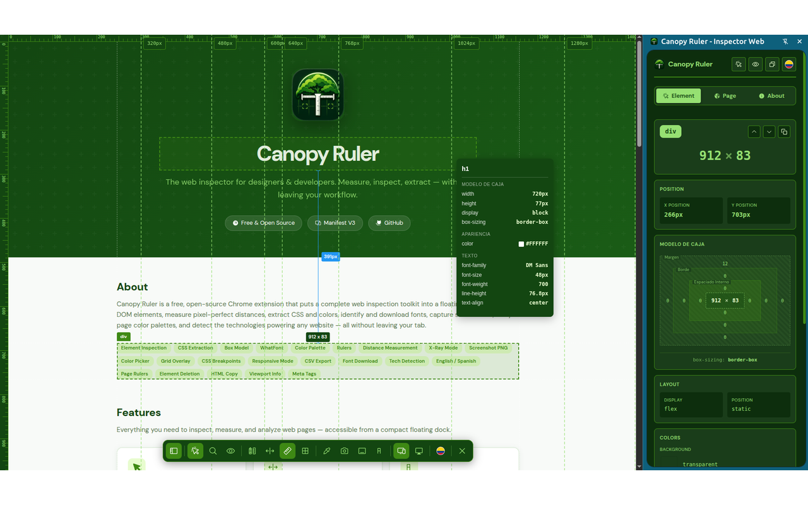
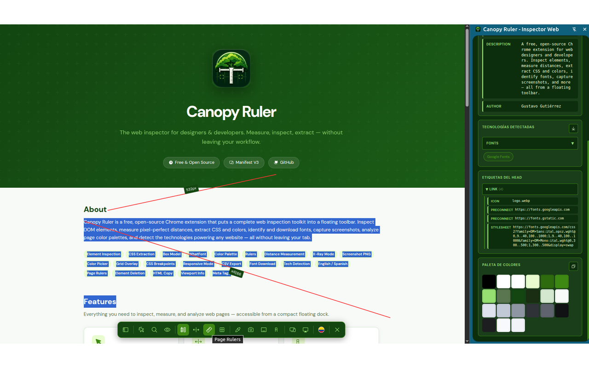
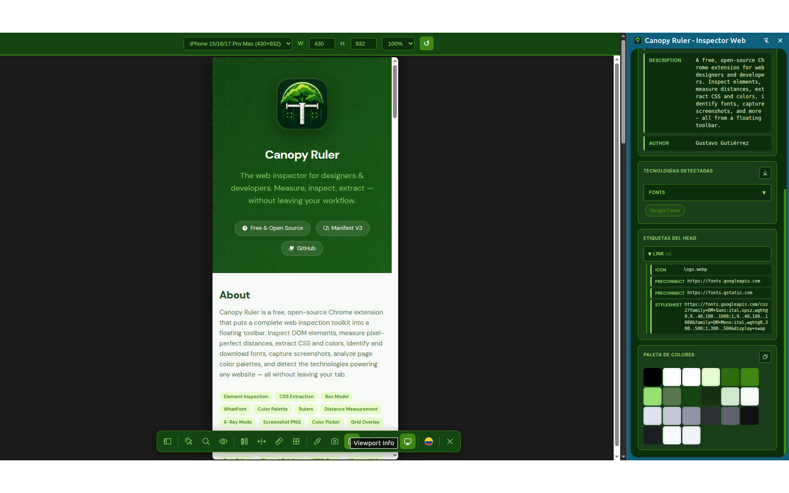

#  Canopy Ruler

[](manifest.json)
[](LICENSE)
[](https://developer.chrome.com/docs/extensions/mv3/)
[]()
[](CONTRIBUTING.md)

> The measuring tool that spreads like a canopy over your web page.

**Canopy Ruler** is a free, open-source Chrome extension that puts a complete web inspection toolkit into a floating toolbar. Inspect DOM elements, measure pixel-perfect distances, extract CSS and colors, identify and download fonts, capture screenshots, analyze page color palettes, and detect the technologies powering any website — all without leaving your tab.

---

## Features

### Element Inspection
- **Visual inspector** — hover to highlight, click to select any DOM element
- **Side panel** with detailed element information: dimensions, position, layout, colors, typography
- **Visual box model** — margin, border, padding, and content dimensions displayed as nested layers
- **Parent/child navigation** via buttons or keyboard shortcuts (`Alt+↑` / `Alt+↓`)
- **Dashed guide lines** on selected elements
- **Copy CSS**, copy selector, copy HTML, delete element — all from the panel

### Measurement Tools
- **Rulers** — click-and-drag floating rulers for free-form measurement
- **Page Rulers** — horizontal and vertical rulers with pixel scale on viewport edges
- **Distance** — measure pixel distance between any two elements
- **Grid Overlay** — superimpose an alignment grid over the page

### Typography & Fonts
- **WhatFont** — hover over text to identify font family, weight, style, size, line height, and color
- **Click to pin** — detailed popover with live font preview
- **Font download** — download actual font files (.woff2, .woff, .ttf) from Google Fonts, Adobe Fonts, Typekit, Bunny Fonts, Fontshare, and any `@font-face` declaration

### Colors
- **Color Picker** — eyedropper tool to pick any color from the page, copied to clipboard
- **Color Palette** — full page color palette in the Page tab, sorted by hue. Hover for hex codes, click to copy, copy all at once

### Page Analysis
- **Meta Tags & SEO** — view all meta tags with name and content
- **Technology Detection** — identifies 100+ frameworks, libraries, analytics, CDNs, CMS, and backend languages. Grouped by category with collapsible headers. Export to CSV
- **Head Tags** — canonical links, preconnect, favicons, preload hints — grouped by type

### Visual Tools
- **X-Ray Mode** — outline every element to visualize DOM structure
- **CSS Breakpoints** — detect and display responsive breakpoints
- **Responsive Mode** — resizable viewport simulator
- **Viewport Info** — window, document, and screen dimensions with DPR and current breakpoint
- **Screenshot** — capture the visible tab as PNG with one click

### Resources
- Extract and preview images and SVGs from a selected element
- **SVG preview** — inline SVGs render as actual graphics (not placeholders)
- Download individual images or all at once

### Language
- **Bilingual** — toggle between English and Spanish with one click
- Flag icons (🇨🇴 / 🇺🇸) indicate current language
- Preference persists across sessions via `chrome.storage`

---

## Keyboard Shortcuts

| Shortcut | Action |
|---|---|
| `Alt+Shift+S` | Toggle the floating dock / activate inspection |
| `Alt+↑` | Select parent element |
| `Alt+↓` | Select child element |
| `Backspace` / `Delete` | Remove selected ruler |
| `Escape` | Exit current tool / close extension |
| `Enter` | Confirm find element search |

---

## Installation

### From Source (Developer Mode)
1. Clone the repository:
   ```bash
   git clone https://github.com/GustavoGutierrez/canopy-ruler.git
   ```
2. Open Chrome and navigate to `chrome://extensions/`
3. Enable **Developer mode** (toggle in the top-right corner)
4. Click **Load unpacked** and select the `canopy-ruler/` folder
5. Press `Alt+Shift+S` or click the extension icon to activate

---

## Project Structure

```
canopy-ruler/
├── manifest.json          # Chrome MV3 extension manifest
├── background.js          # Service worker (screenshots, downloads, context menu)
├── scripts/
│   └── content.js         # Content script (dock, rulers, inspection, WhatFont, etc.)
├── sidepanel/
│   ├── index.html         # Side panel UI (3 tabs: Element, Page, About)
│   ├── panel.js           # Panel controller
│   └── styles.css         # Panel styles (Green Forest theme)
├── images/
│   ├── icon{16,32,48,64,128}.png  # Extension icons
│   ├── usa.svg / colombia.svg     # Language flags
│   ├── icons/                      # Phosphor Icons SVGs
│   └── pattern/                    # Utility pattern SVGs
├── docs/
│   └── index.html         # GitHub Pages documentation
├── _locales/
│   ├── en/messages.json   # English strings
│   └── es/messages.json   # Spanish strings
├── LICENSE                # MIT License
├── CONTRIBUTING.md        # Contribution guide
└── README.md              # This file
```

---

## Technology Stack

- **Manifest V3** — latest Chrome extension APIs
- **Vanilla JavaScript** — no frameworks, zero dependencies
- **CSS Custom Properties** — dynamic theming
- **Phosphor Icons** — scalable SVG icons (MIT licensed)
- **DM Sans & DM Mono** — Google Fonts

---

## Color Theme

Canopy Ruler uses a **Green Forest** palette inspired by a canopy of trees:

| Name | Hex | Usage |
|---|---|---|
| Forest Black | `#134611` | Dark backgrounds |
| Forest Green | `#3e8914` | Primary accents, active states |
| Jungle | `#3da35d` | Hover states |
| Light Green | `#96e072` | Accent text, icon color |
| Frosted Mint | `#e8fccf` | Light backgrounds, highlights |

---

## Screenshots







---

## Author

**Gustavo Gutiérrez** — Bogotá, Colombia

[ LinkedIn](https://www.linkedin.com/in/gustavo-gutierrez-mercado)

---

## Credits

- **Icons**: [Phosphor Icons](https://phosphoricons.com) — MIT licensed
- **Fonts**: [DM Sans](https://fonts.google.com/specimen/DM+Sans) & [DM Mono](https://fonts.google.com/specimen/DM+Mono) — Google Fonts
- **Flags**: Circular flag SVGs for language switching

---

## License

MIT © Gustavo Gutiérrez. See [LICENSE](./LICENSE) for details.
